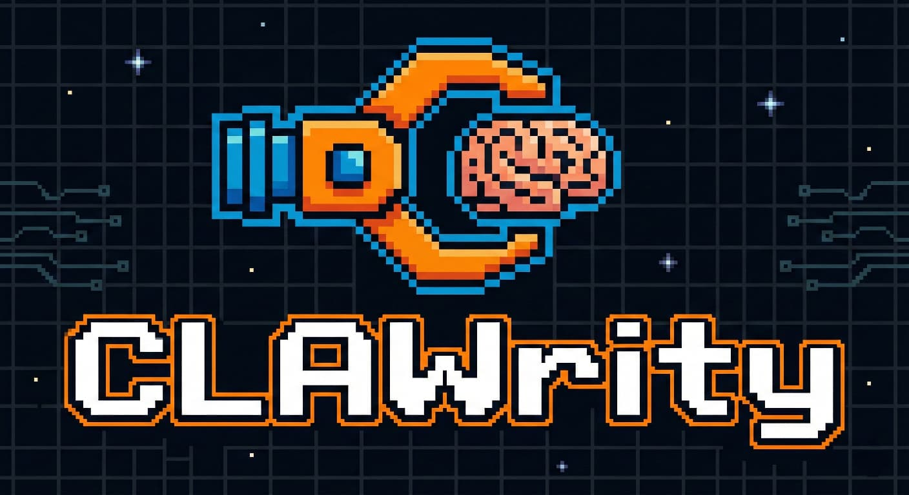

<div align="center">
  
</div>

# CLAWrity 🦞🧠

> Your neurodivergent-friendly companion for OpenClaw.

CLAWrity is an [OpenClaw](https://github.com/openclaw/openclaw) skill that provides ADHD & Autism support through six companion modes: body doubling, task decomposition, transition help, sensory breaks, social scripting, and celebration.

Built for brains that work differently. No judgment. No "just try harder." Just presence, structure, and celebration.

---

## Quick Start

```bash
npx clawrity@latest
```

That's it. The installer will walk you through setup.

---

## What CLAWrity Does

| Mode | Trigger Phrases | What Happens |
|------|----------------|--------------|
| 🧑‍💻 **Body Double** | "sit with me", "I can't start", "body double me" | Companion works alongside you with focused co-working visuals |
| 📋 **Task Decomposition** | "I'm overwhelmed", "break it down", "too much" | Breaks large tasks into tiny, dopamine-friendly micro-steps |
| 🌉 **Transition Helper** | "what's next", "I can't switch", "help me move on" | Guides you through activity changes with calming bridge visuals |
| 🌿 **Sensory Break** | "sensory overload", "meltdown", "too loud" | Delivers calming, low-stimulation scenes and grounding support |
| 💬 **Social Script** | "how do I say", "help me respond", "awkward email" | Generates communication scripts with multiple tone variants |
| 🎉 **Celebration** | "I did it!", "done!", "I finally..." | Celebrates your wins with genuine enthusiasm and reward visuals |

---

## Prerequisites

- **[OpenClaw](https://docs.openclaw.ai)** — installed and running
- **[fal.ai](https://fal.ai)** — API key for image generation (optional — CLAWrity works in text-only mode without it)

---

## Installation

### Option 1: npx (Recommended)

```bash
npx clawrity@latest
```

The installer will:
1. ✅ Check for OpenClaw installation
2. 🔑 Prompt for your fal.ai API key
3. 🧠 Ask you to select a profile (ADHD / Autism / AuDHD)
4. 📁 Copy skill files to `~/.openclaw/workspace/skills/clawrity/`
5. ⚙️ Update `~/.openclaw/openclaw.json`
6. 💜 Inject the companion persona into `SOUL.md`

### Option 2: Manual Installation

1. Clone the repo:
   ```bash
   git clone https://github.com/SudheerNaraharisetty/CLAWrity.git
   cd CLAWrity
   ```

2. Copy skill files:
   ```bash
   cp -r skill/ ~/.openclaw/workspace/skills/clawrity/
   cp -r scripts/ ~/.openclaw/workspace/skills/clawrity/scripts/
   ```

3. Add your fal.ai key to `~/.openclaw/openclaw.json`:
   ```json
   {
     "skills": {
       "entries": {
         "clawrity": {
           "enabled": true,
           "env": {
             "FAL_KEY": "your_fal_key_here"
           }
         }
       }
     }
   }
   ```

4. Append the persona to your `SOUL.md`:
   ```bash
   cat templates/soul-injection.md >> ~/.openclaw/workspace/SOUL.md
   ```

---

## Profiles

CLAWrity adapts its behavior based on your profile:

### ADHD
- Task initiation and time blindness support
- Dopamine-friendly micro-steps
- Body doubling as primary support mechanism
- Short, action-oriented communication

### Autism
- Routine and predictability emphasis
- Sensory management as core priority
- Social scripting with tone variants (formal/casual/assertive)
- Direct, unambiguous communication

### AuDHD (ADHD + Autism)
- Handles contradictory needs (novelty vs. routine)
- Dual-system sensory calibration
- RSD-aware social scripting
- Burnout prevention focus

---

## How It Works

1. **You message your OpenClaw agent** with a natural request
2. **CLAWrity detects the mode** from your language (auto-detection or explicit)
3. **A companion visual is generated** using your reference image via fal.ai
4. **Supportive text + visual are sent** back to your messaging platform

Works on: WhatsApp, Telegram, Slack, Discord, Signal, MS Teams, and more.

---

## Custom Companion Image

CLAWrity includes a default companion image. To use your own:

```json
{
  "skills": {
    "entries": {
      "clawrity": {
        "env": {
          "CLAWRITY_COMPANION_IMAGE": "https://your-image-url.png"
        }
      }
    }
  }
}
```

---

## Project Structure

```
CLAWrity/
├── bin/
│   └── cli.js              # npx installer wizard
├── skill/
│   └── SKILL.md             # Skill definition (trigger patterns, prompts, API specs)
├── scripts/
│   ├── clawrity.sh          # Bash implementation
│   └── clawrity.ts          # TypeScript implementation
├── templates/
│   ├── soul-injection.md    # Companion persona for SOUL.md
│   └── profiles/
│       ├── adhd-default.md  # ADHD-focused profile
│       ├── autism-default.md # Autism-focused profile
│       └── audhd-default.md # AuDHD combined profile
├── assets/
│   └── companion.png        # Default companion reference image
├── package.json
├── CLAUDE.md                # Project conventions
└── README.md
```

---

## Environment Variables

| Variable | Required | Description |
|----------|----------|-------------|
| `FAL_KEY` | No | fal.ai API key for image generation (text-only mode if not set) |
| `OPENCLAW_GATEWAY_TOKEN` | No | Gateway token (fallback if CLI unavailable) |
| `CLAWRITY_COMPANION_IMAGE` | No | Override default companion image URL |

---

## Community

- 🐛 [Report Issues](https://github.com/SudheerNaraharisetty/CLAWrity/issues)
- 💡 [Feature Requests](https://github.com/SudheerNaraharisetty/CLAWrity/issues)
- 🦞 [OpenClaw Community](https://github.com/openclaw/openclaw)

---

## License

MIT © [Sai Sudheer Naraharisetty](https://github.com/SudheerNaraharisetty)
